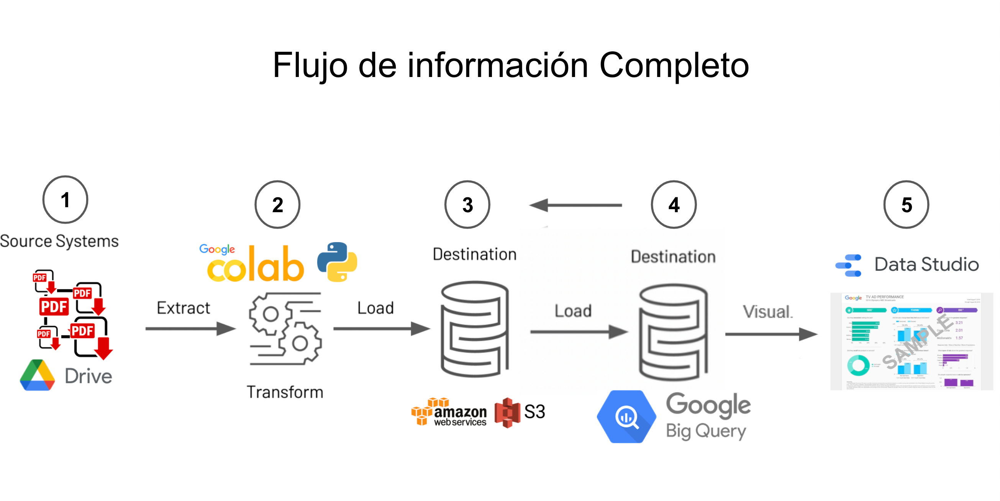

# Buscador de datos Financieros 

## Objetivo

Nebula financiera es un proyecto montado en la nube que busca atender a las necesidades de la DG de finanzas a partir del el aprovisionamiento de información automática de los estados financieros públicos que permita su escalabilidad, manipulación y visualización de datos.

## Flujo de información

**1 Source Systems**  A partir de de los reportes BBVA, Banorte y Santander se extrae de manera automatizada la información (se encuentra en la carpeta *estadosFinancieros*) relevante para su transformación.

**2 Extract**  Mediante google colab se generan notebooks de limpieza para cada uno de los reportes (se encuentra en la carpeta `notebooks/'cada banco'` para cada banco) para después unificarlos y cargarlos a Amazon aws (`notebooks/unificador_tablas.ipynb`).

**3 Destination**  La información se guarda dentro de Amazon S3 y la consulta se toma a partir de Google Big Query para poder visualizarlo en Data Studio.

**4 Destination**  Visualizador de los datos financieros de los bancos que permita conocer las principales métricas de cada banco y permita la toma de decisiones.

